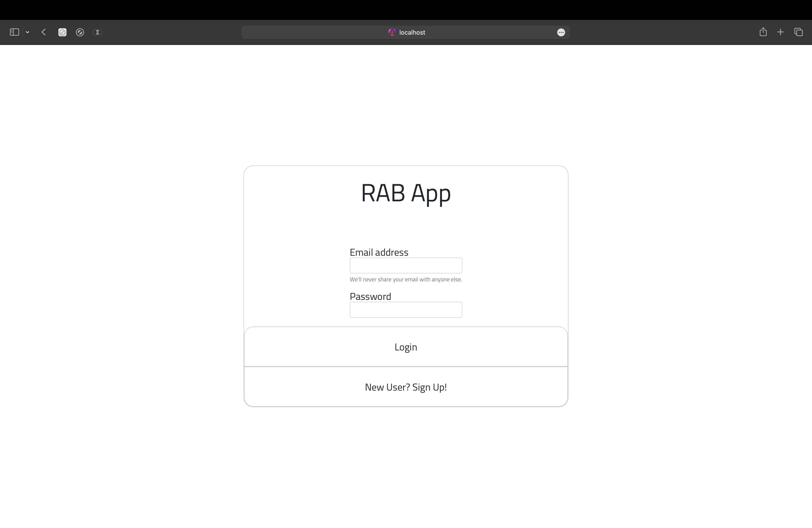
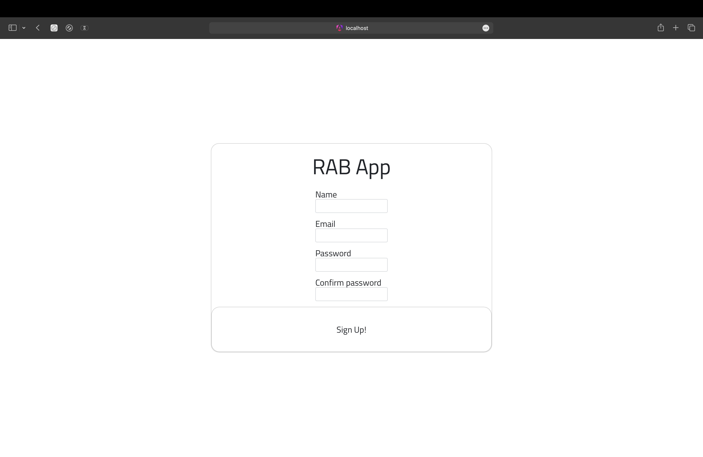
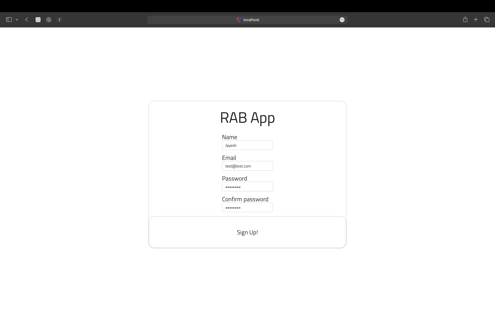
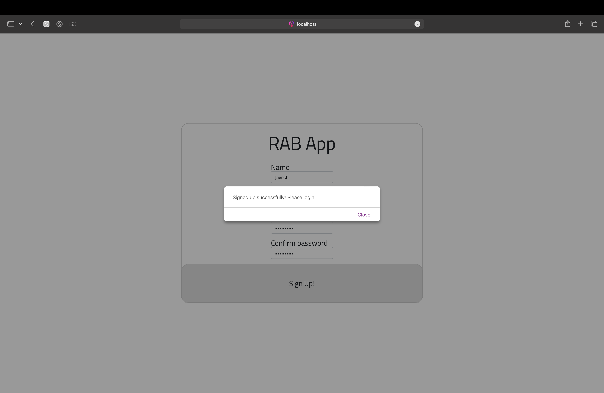
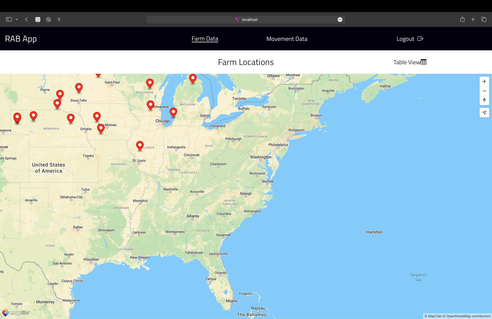
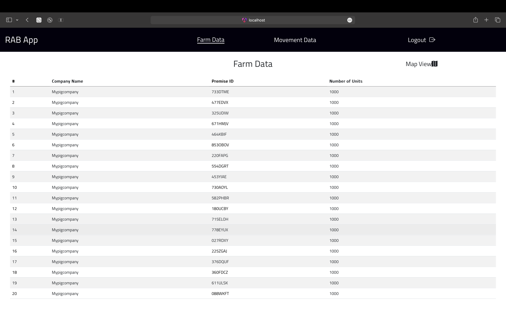
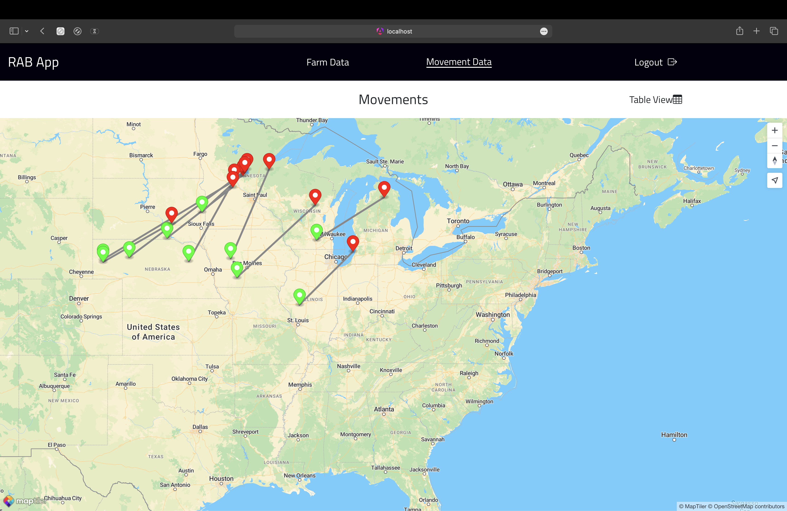
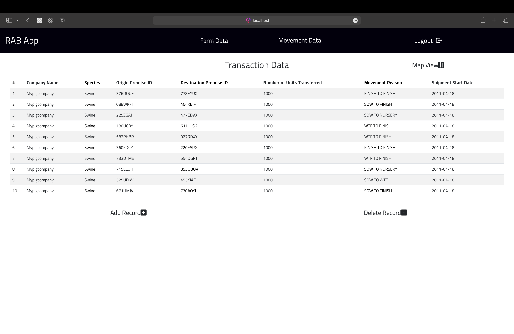

# RAB APP
This application visualizes and manages the movement records of livestock between different farms.

## How to Run
1. Clone this repository
2. Execute `docker-compose up` in the root folder containing the `docker-compose.yml` file(not working as expected as of now, please check How to Run - Alternate).

## How to Run - Alternate
1. Clone this repository.
2. Check the requirements section.
3. To start the backend server, navigate to `backend/src/main/resources` and edit the application.properties file with appropriate datasource, username and password for postgres the postgres server you want to use.
4. Navigate back to `backend` and in the terminal, run the following command: `mvn spring-boot:run`
5. The backend should start up at `port 8080` of your localhost and create the required entities in the database.
6. Please confirm that your local postgres database is up and running before starting the backend.
7. To start the frontend, open another terminal in the RABApp-Challenge folder and navigate to `food-process-frontend`
8. Run `npm install`
9. Run `npm start` or `ng serve`
10. The frontend should start at `port 4200` of your localhost.
11. In your browser, go to `http://localhost:4200/` to start using the app.
12. You may have to signup before you login.
13. Please watch `demo.mp4` to get acquainted with the UI and it's functionalities.

## Requirements:
1. NPM version - 10.7.0
2. Node version - 22.1.0

## UI Screenshots
Login/Signup Page:

Farm Data:

Movement Data:

## Features
1. Users can register on the application and use those credentials for logging into the app.
2. The app uses token based authorization to verify whether the user has access to the main app.
3. The Farm Data view provides a visual representation(map) as well as a table to describe Farm Data.
4. The Movement Data view provides a visaulization of all the movements occuring between farms using an interactive map.
5. The Table View within the Movement Data view provides the user with options to add or delete records with appropriate validations. For example, only valid premise IDs can be chosen while adding new records.
6. The changes made in the Movement Data reflect in the Farm Data as well.

## App Design
1. The app uses four main tables as of now with more tables to be integrated soon(check Future improvements section).
2. The Spring Boot app utilizes Spring Data JPA to get, post, put and delete records from both movement and farm data.
3. The frontend is constructed using Angular(typescript) framework with bootstrap css and custom css elements.
4. Maptiler SDK is used to implement the map features.
5. Farm, Movement, Company and User Objects have been created in the frontend as well as backend to give a structure to the data.

## Database Schema

### Table: app_user

| Column   | Type                  | Nullable | Default               |
|----------|-----------------------|----------|-----------------------|
| id       | bigint                | not null | nextval('app_user_id_seq'::regclass) |
| email    | character varying(255)|          |                       |
| name     | character varying(255)|          |                       |
| password | character varying(255)|          |                       |

**Indexes:**
- `app_user_pkey`: PRIMARY KEY, btree (id)

---

### Table: companies

| Column       | Type                  | Nullable | Default               |
|--------------|-----------------------|----------|-----------------------|
| company_id   | bigint                | not null | nextval('company_id_seq'::regclass) |
| company_name | character varying(100)|          |                       |

**Indexes:**
- `companies_pkey`: PRIMARY KEY, btree (company_id)

---

### Table: farm

| Column          | Type               | Nullable | Default |
|-----------------|--------------------|----------|---------|
| premiseid       | character varying(7)| not null |         |
| total_animal    | integer            |          |         |
| farm_company    | character varying(255)|         |         |
| farm_latitude   | double precision  |          |         |
| farm_longitude  | double precision  |          |         |

**Indexes:**
- `farm_pkey`: PRIMARY KEY, btree (premiseid)

**Referenced by:**
- `movement`: FOREIGN KEY (new_destinationpremid) REFERENCES farm(premiseid)
- `movement`: FOREIGN KEY (new_originpremid) REFERENCES farm(premiseid)

---

### Table: movement

| Column                 | Type                        | Nullable | Default |
|------------------------|-----------------------------|----------|---------|
| id                     | integer                     | not null | nextval('movement_id_seq'::regclass) |
| account_company        | character varying(255)      |          |         |
| new_movementreason     | character varying(255)      |          |         |
| new_species            | character varying(255)      |          |         |
| new_originaddress      | character varying(255)      |          |         |
| new_origincity      | character varying(255)      |          |         |
| new_originname      | character varying(255)      |          |         |
| new_originpostalcode      | character varying(255)      |          |         |
| new_originpremid      | character varying(255)      |          |         |
| new_originstate      | character varying(255)      |          |         |
| new_destinationaddress      | character varying(255)      |          |         |
| new_destinationcity      | character varying(255)      |          |         |
| new_destinationname      | character varying(255)      |          |         |
| new_destinationpostalcode      | character varying(255)      |          |         |
| new_destinationpremid      | character varying(255)      |          |         |
| new_destinationstate      | character varying(255)      |          |         |
| origin_lat      | double precision      |          |         |
| origin_lon      | double precision      |          |         |
| destination_lat      | double precision      |          |         |
| destination_long      | double precision      |          |         |
| new_numitemsmoved      | integer      |          |         |
| new_shipmentsstartdate      | double precision      |          |         |

**Indexes:**
- `movement_pkey`: PRIMARY KEY, btree (id)

**Foreign-key constraints:**
- `movement_new_destinationpremid_fkey`: FOREIGN KEY (new_destinationpremid) REFERENCES farm(premiseid)
- `movement_new_originpremid_fkey`: FOREIGN KEY (new_originpremid) REFERENCES farm(premiseid)

**Triggers:**
- `movement_renumber_ids_trigger`: AFTER DELETE ON movement FOR EACH ROW EXECUTE FUNCTION renumber_ids()

## Challenges Faced
1. Dockerization of the backend is fails due to reasons unknown. Possible diagnosis - improper configuration of the application.properties file in the backend.
2. Data JPA Test not being detected in the spring boot application even though the dependencies were configured properly.
3. Karma-Jasmine find 0 specs even though karma has been configured properly.
4. maplibre-gl, which was used to add visualization to the map component, does not use ECMA script which may throw errors during run time.
5. Currently, the movement data doesn't take cities, states and addresses as inputs when new records are added from the frontend.
6. Lack of animations in the frontend due to major usage of custom CSS rather than UI libraries(see Future Improvements section for the solution)

## Future Improvements
1. Dockerization of the entire app for easier use.
2. Addition of more tables to the current database, which include but are not limited to cities, states and addresses, which will be linked to the farm database, so that the user can easily add movement records by just using the farm premise ID and the backend will add the rest based on the premise ID(currently implemented with the farm coordinates, i.e., based on the premise ID of the farm, the coordinates are added automatically by the backend to the movement database).
3. Addition of user roles, such as admin so that the farm data can be edited in the frontend as well. Current access level is user, where the user can only add and delete records in the movement database but not update any record or perform any crud operations for the farm data (crud operations have been implemented in the backend for both the farm and movement data) - can be done by addition of a roles attribute to the app_user table.
4. Addition of env files to the frontend hide api keys.
5. Incorporating a search by ID feature in the frontend (already implemented in the backend).
6. Addition of animations to make the UI more interactive and engaging - can be achieved by using @Media in css along with transitions.
7. Addition of hover feature on the map component for better UX and clarity - can be achieved by using maptiler sdk and maplibre-gl by adding a "hover" layer.
8. Incorporating keyboard controls to improve usage times of the app and UX of the app - can be achieved by using Keyboard listeners in the frontend.
9. Incorporating more colors in the UI to make the UX more satisfying and engaging.
10. Addition of a 'forgot password' functionality to improve UX.
11. Addition of a "Settings" page for the admin to add users, remove users and edit permissions - Can be done by adding a new component to angular frontend, and adding a service which implements these functionalities in the backend.
12. Addition of a "Profile" page for the user to edit their profile details, such as name and check their permissions - Can be done by adding a new component to the frontend, and a service to read and update user details.
13. Addition of a sort functionality to sort the movement records by date - can be done by calling a sort api from the backend which uses the JPA Repository methods.
14. Fixing the testing library issues in the spring boot app - diagnose why Data JPA Test is not being detected.
15. Fixing the testing library issues in the angular app - diagnose why spec.ts files are not being detetcted by karma-jasmine.
16. Addition of a logo for branding purposes.
17. Improving styles by consistent spacing between text and symbols.

## Target Role
Fullstack developer
